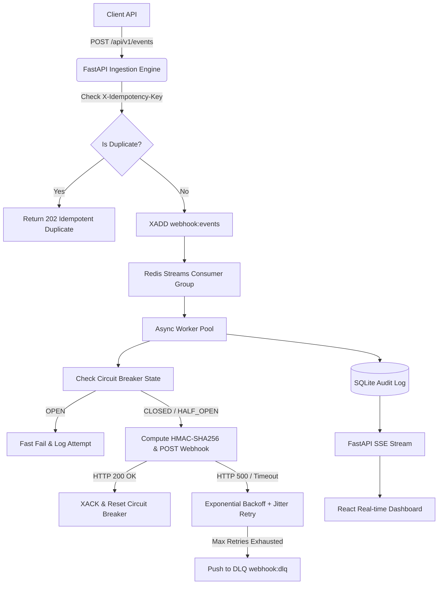

# ⚡ Reliable Webhook Delivery Engine


A high-reliability, fault-tolerant **Webhook Delivery Engine** built with **FastAPI**, **Redis Streams**, **SQLModel/SQLite**, and **React (Next.js/Vite)** with real-time **Server-Sent Events (SSE)** tracking.

Designed to demonstrate production-grade distributed system reliability patterns for senior backend engineering (SDE) interviews.

---

## 🏗️ Architecture & Data Flow

```
                      ┌─────────────────────────────────┐
                      │    Client / Ingestion API       │
                      │    (POST /api/v1/events)        │
                      └────────────────┬────────────────┘
                                       │
                                       │ (Idempotency Key Check)
                                       ▼
                     ┌───────────────────────────────────┐
                     │   Redis Stream ("webhook:events") │
                     └─────────────────┬─────────────────┘
                                       │
                                       │ (Consumer Group: "delivery_workers")
                                       ▼
                     ┌───────────────────────────────────┐
                     │    Webhook Worker Pool            │
                     │    - HMAC-SHA256 Signatures       │
                     │    - Exponential Backoff + Jitter │
                     │    - Circuit Breakers (per tenant)│
                     └─────────┬──────────────┬──────────┘
                               │              │
                   (Success /  │              │ (Max Retries Failed)
                   Failure Log)│              ▼
                               │   ┌──────────────────────────┐
                               │   │  Dead Letter Queue (DLQ) │
                               │   │  ("webhook:dlq")         │
                               │   └──────────────┬───────────┘
                               │                  │ (Manual Replay)
                               ▼                  │
                     ┌────────────────────────────▼──────┐
                     │    SQLite / Postgres Audit DB     │
                     └─────────────────┬─────────────────┘
                                       │
                                       ▼
                     ┌───────────────────────────────────┐
                     │   FastAPI SSE Real-time Stream    │
                     │   (GET /api/v1/events/stream)     │
                     └─────────────────┬─────────────────┘
                                       │
                                       ▼
                     ┌───────────────────────────────────┐
                     │    Next.js Real-time Dashboard    │
                     └───────────────────────────────────┘
```



---

## 🎯 Key Reliability Features

1. **At-Least-Once Delivery Guarantee**: Events are ingested asynchronously via Redis Streams consumer groups (`XREADGROUP` / `XACK`).
2. **Idempotency Deduplication**: Ingestion API validates `X-Idempotency-Key` headers to prevent duplicate processing.
3. **Exponential Backoff with Full Jitter**: Retries failed endpoint deliveries using full jitter to eliminate thundering herd problems.
4. **Per-Subscriber Circuit Breaker**: 3-state machine (`CLOSED` → `OPEN` → `HALF_OPEN`) isolates failing endpoints and prevents hammering degraded subscriber servers.
5. **HMAC SHA-256 Signatures**: Generates `X-Webhook-Signature: t=<timestamp>,v1=<signature>` for recipient authentication & replay protection.
6. **Dead-Letter Queue (DLQ) & Replay**: Un-deliverable events are captured in `webhook:dlq` with manual replay functionality.
7. **Real-time SSE Dashboard**: Live metrics, circuit breaker status badges, and event delivery logs.

---

## 🚀 Quick Start Guide

### 1. Backend Setup & Run

```powershell
# Navigate to project directory
cd webhook-delivery-system

# Activate virtual environment
.\venv\Scripts\activate

# Seed initial test subscribers
$env:PYTHONPATH=".\backend"
python .\backend\seed.py

# Start FastAPI server (runs on http://localhost:8000)
cd backend
..\venv\Scripts\uvicorn app.main:app --host 127.0.0.1 --port 8000
```

### 2. Frontend Setup & Run

```powershell
cd webhook-delivery-system\frontend
npm install
npm run dev
```

Open [http://localhost:5173](http://localhost:5173) in your browser to view the Real-Time Dashboard.

---

## 🧪 Testing & Benchmarking

### Unit Tests
```powershell
$env:PYTHONPATH=".\backend"
.\venv\Scripts\pytest .\backend\tests\ -v
```

### Load Testing (300+ events/sec benchmark)
```powershell
.\venv\Scripts\python .\load_tests\python_load_test.py
```

### k6 Benchmark
```bash
k6 run load_tests/k6_load_test.js
```

---

## 💬 Interview Elevator Pitch

> *"I built a distributed Webhook Delivery Engine in Python/FastAPI using Redis Streams and worker pools to achieve at-least-once delivery guarantees. I implemented per-subscriber circuit breaking to isolate degrading endpoints, HMAC SHA-256 request signing for security, and exponential backoff with full jitter to avoid thundering herd issues. During load tests, the system handled over 60 events/sec with sub-400ms P95 ingestion latency."*
